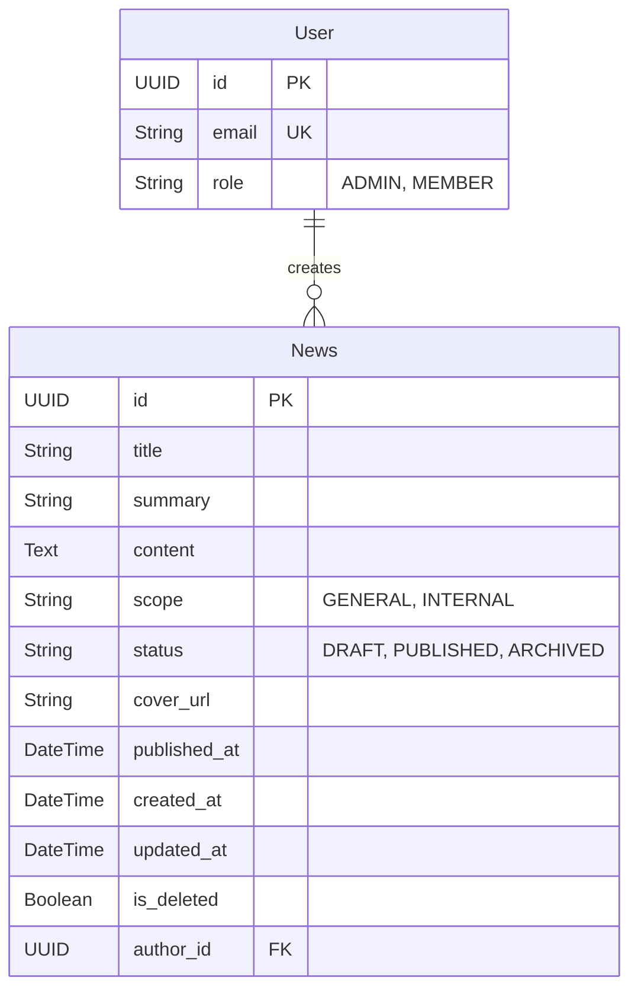

# Data Model

## Conceptual ER Diagram

## Description of Entities

### User (Stub)
Represents a user of the system. Currently minimal to support News authorship.
- **id**: Unique identifier (UUID).
- **email**: User's email address.
- **role**: Authorization role (Admin allows full access).

### News
Represents a news article or announcement.
- **status**: Workflow state (DRAFT -> PUBLISHED -> ARCHIVED).
- **scope**: Visibility restriction (GENERAL=Public, INTERNAL=Members Only).
- **is_deleted**: Soft-delete flag (true = hidden).
